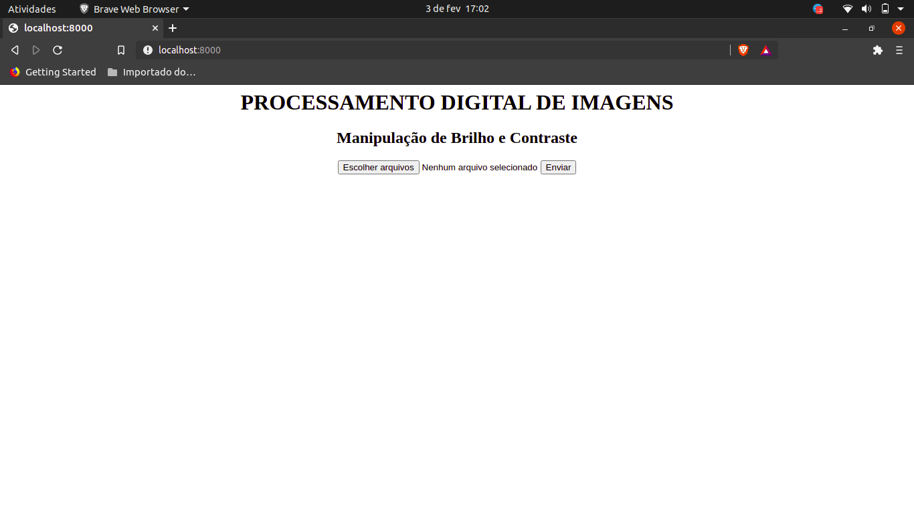
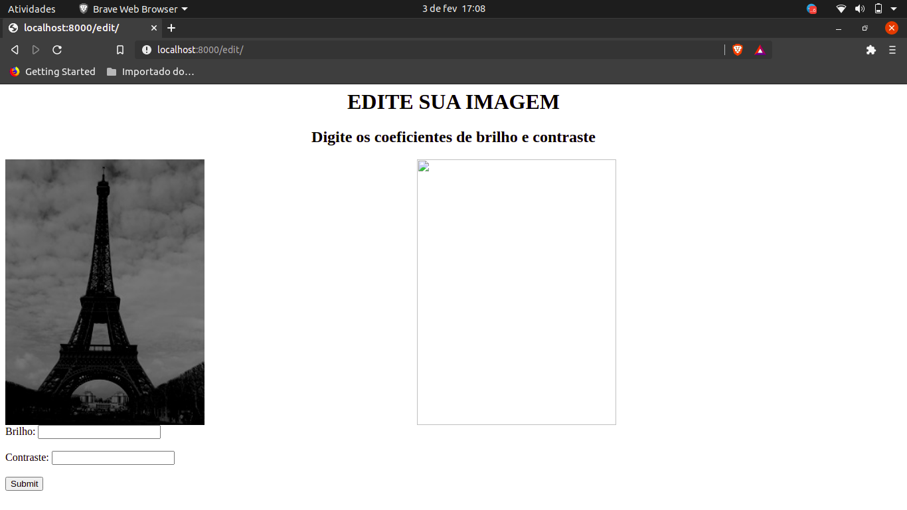

# WebPDI
Um simples app web para processamento de imagens utilizando FastApi e OpenCV.

# Como rodar

1. Instale as dependências:

```
pip install -r requirements.txt
```

2. Rode o servidor:

```
uvicorn main:app --reload
```

3. Abra seu navegador e acesse ```http://localhost:8000/```. Você verá esta janela:



Clique em "Escolher arquivo" e escolha uma imagem <b>em tons de cinza</b> para fazer upload. Depois, clique em "Enviar".

Você será redirecionado para esta página:




4. Digite um número inteiro nos campos de texto Brilho e Contraste. É interessante que o número para brilho seja entre 0 e 100 e o de contraste esteja entre 2 e 5 (Acima disso, a imagem vai ficar estranha).

Eu digitei os numeros 50 para Brilho e 2 para Contraste.

5. Clique em "Submit" e a imagem modificada aparecerá ao lado direito, como na imagem abaixo:


